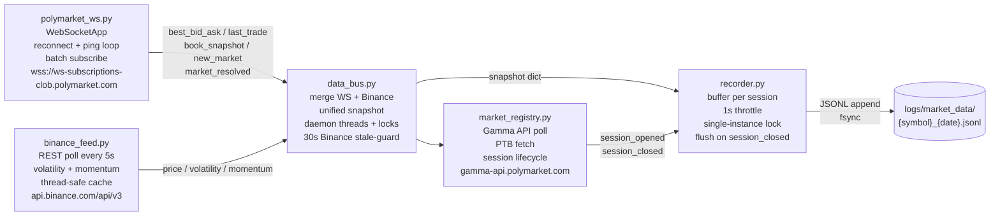
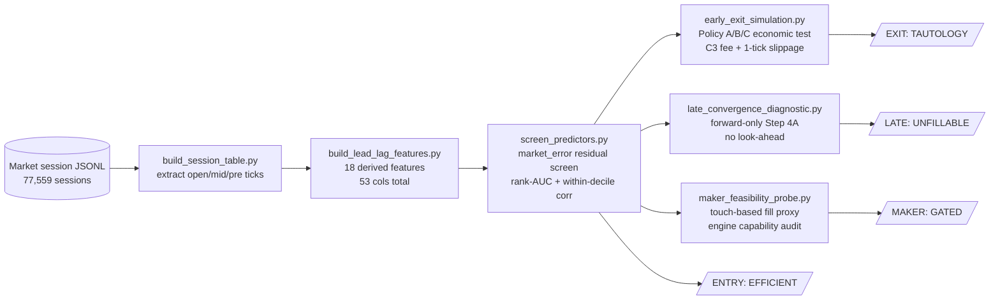
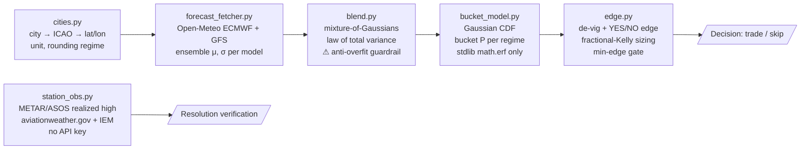
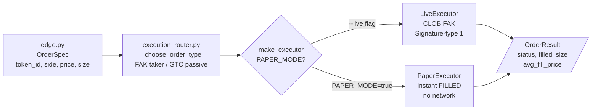

# Polymarket Research Suite

> A systematic investigation into whether retail edge exists in Polymarket prediction
> markets — four research fronts, most honestly disproven.

→ **[HOW_TO_USE.md](HOW_TO_USE.md)** — quick-start, run commands, and code snippets for every module.

This repository documents a multi-month study across crypto price-interval and daily-
temperature weather markets on Polymarket. The work is presented not as a profitable
trading system, but as an exercise in **engineering discipline and honest methodology**:
knowing when to close a research front is at least as important as knowing how to open one.

---

## TL;DR

| Front | Hypothesis | Verdict |
|-------|------------|---------|
| Crypto: entry edge | Orderbook lags Binance at session open → lead-lag entry | **MARKET EFFICIENT** |
| Crypto: maker spread | Post limit orders, earn spread instead of paying fee | **GATED** (maker fee unknown) |
| Weather: D-1 forecast-arb | Ensemble model finds mispriced temperature buckets | **NEEDS FORWARD DATA** |
| Weather: intraday price-path | Basket of confident model positions profitable intraday | **UNTESTABLE ON HISTORY** |

The headline result is not "the strategy works." It is: **four well-posed hypotheses were
tested with cost-inclusive, forward-only simulations, and the evidence did not support any
of them.** The strongest selling point of this work is correctly diagnosing the *absence*
of edge — and documenting exactly why each apparent edge was illusory.

---

## Why this is different: four illusion-traps caught

These are the moments where standard practice would have declared a win, and honest
methodology caught the error.

### 1. The backtest-vs-live trap (underdog_v4)

Early signal discovery produced presets with backtest win rates of **78–83%**, well above
the published 71.8% Polymarket breakeven bar. They looked like winners. Live trading
produced **−$7.30 over 774 trades** at 78% backtest WR.

The 71.8% breakeven was computed against a silently optimistic model: 100% fill at quoted
mid, zero taker fee, zero slippage, no FAK rejection. Three real drags closed the gap:

- **Adverse selection:** forensic analysis found filled win rate = 73.7% vs hypothetical-
  reject win rate = 77.3% (z-test p = 0.098, n = 774). The venue systematically accepts
  the worse signals. FAK kill rate measured at ~40% live.
- **Taker fee:** calibrated against 109 on-chain fill/chain pairs to `fee = 7.2% × p × (1−p)`,
  RMSE = 0.000786. This fee alone shifts the breakeven bar by several percentage points.
- **Slippage:** p50 ≈ 0 bps, but p95 = 610 bps, p99 = 1,184 bps — the tail matters.

Corrected real breakeven: **78–82%**, not 71.8%. This finding triggered a full Reality
Calibration phase (C3 fee model, C4 slippage, C5 fill-rate calibration) inserted ahead
of all remaining work.

### 2. Look-ahead bias self-caught (late-window and price-path analysis)

An early late-window simulation produced an exciting result: **WR 66.1%, total +$3,035**.

The error: the trade-entry criterion was `market_error_late ≠ 0`, where `market_error_late`
is defined using the actual binary outcome. This only enters trades you already know you win
— a pure look-ahead contamination. The contaminated computation was explicitly labeled
`⚠ LOOK-AHEAD — informational only` in the codebase and excluded from the verdict.

The forward-only corrected simulation (Step 4A, using only `late_binance_dir != 0` — an
observable at t ≈ 40s with no outcome information): n = 40,170, WR = **45.6%**, total = **−$612**.

The same discipline appears in the weather H3 analysis: the "winner-only price travel"
analysis is explicitly fenced: *"⚠ LOOK-AHEAD — you cannot know the winner in the morning."*

### 3. Open-Meteo vs METAR measurement bug (W2.5 → W2.6 retraction)

The W2.5 validation phase concluded: **"EDGE IS REAL — 3/5 cities."** Tokyo, Seoul, and
Shanghai all showed the ensemble model closer to the realized temperature than the market.

The error: realized temperatures were sourced from **Open-Meteo reanalysis** (`forecast+past_days=2`)
instead of from station observations. Open-Meteo underestimated actual airport-station
temperatures by:

| City | Open-Meteo | METAR/ASOS | Error |
|------|------------|------------|-------|
| Tokyo (RJTT) | 20.2°C | 22.0°C | **+1.8°C** |
| Seoul (RKSI) | 20.6°C | 25.0°C | **+4.4°C** |
| Shanghai (ZSPD) | 24.1°C | 25.0°C | **+0.9°C** |

In every case, the market's bucket matched the METAR/ASOS realized temperature.
The market was correct all along; the "edge" was measurement error.

W2.5 verdict retracted. W2.6 verdict: **WAS OUR ERROR.** Rule established:
*never use Open-Meteo as a proxy for station-observed temperature.*

### 4. Model-disagreement fake edge (two forms)

**Form 1 (W0):** A single ensemble model (ECMWF, μ = 15.90°C) reported +0.18 YES edge on the
15°C London bucket. The other ensemble model (GFS, μ = 18.15°C) contradicted it completely,
placing the peak probability at 18°C. The "edge" was an artifact of **2.25°C inter-model
disagreement** on a 1°C-wide bucket ladder, not market mispricing. The correct response is
a blended distribution with σ wider than either individual model — which is what `blend.py`
enforces structurally.

**Form 2 (fill-rate model):** A pooled fill-rate logistic model passed the ±2pp calibration
gate and appeared validated. In reality, it discriminated < 1pp across the realistic spread
range, compared to 11pp in the raw data. The NO-side slope (b₁ = −15.7) was diluted 17×
by averaging with the opposite-signed YES-side slope (b₁ = +5.7). The aggregate gate was
blind to this collapse. Rule established: *fit per-side first; pool only if slopes agree in
sign and are within ~2× magnitude.*

---

## Architecture

The four diagrams below tell the full story in sequence: live feeds are captured by the
ingestion layer → JSONL session files → crypto research pipeline → verdicts; weather
pipeline runs in parallel on its own data path.

### Data ingestion (live capture)



All five files communicate only through callbacks and snapshot dicts — no shared global
state except the `DataBus` instance, which is the deliberate integration point. All
endpoints are public and keyless. The resulting JSONL files are the input to the crypto
discovery pipeline below.

**JSONL log schema** (compact — full annotated schema: `data_ingestion/README.md`):

```python
# Session-level record (appended at session close)
{
    "slug":               "btc-updown-5m-1773100500",  # primary join key
    "symbol":             "BTC",
    "interval":           5,                            # minutes (5 or 15)
    "recorded_at":        1773100536.5,                # Unix ts (session open)
    "ptb":                83400.0,                     # Binance open price ("price to beat")
    "open_binance_price": 83420.5,
    "open_volatility":    0.082,                       # % std dev, last 20 1-min closes
    "open_momentum_5m":  -0.031,                       # % 5-min Binance change at open
    "close_price":        83450.0,
    "close_volatility":   0.091,
    "actual_outcome":     "UP",                        # UP / DOWN — recomputed at read time
    "snapshots":          [...],                        # per-tick list (see below)
    "market_info":        {"yes_token_id": ..., "no_token_id": ..., "market_condition_id": ..., "end_date": ...}
}

# Per-tick snapshots[] entry (1-second throttle)
{
    "t":             142,      # seconds remaining until expiry
    "mid":           0.615,   # YES token mid price (0–1)
    "spread":        0.010,
    "bid_volume":    340.5,   # USDC liquidity, top-5 book levels
    "ask_volume":    120.2,
    "imbalance":     0.478,   # (bid−ask)/(bid+ask)
    "last_trade":    0.610,   # most recent trade price (null at session open)
    "binance_price": 83420.5,
    "price_diff_pct": 0.024,  # % drift from ptb
    "momentum_3m":   0.014,   # % 3-min Binance change
    "momentum_5m":  -0.031,   # % 5-min Binance change
    "timestamp":     1773100536.5,
}
```

### Crypto discovery engine



### Weather forecast-arb pipeline



### Execution architecture (described, not shipped in this repo)



The execution layer (routers, executors, auth, signing) is not included in this public
repository — it is proprietary live-trading infrastructure. The diagram above illustrates
the system design.

The full engine also included a Telegram alerting layer — log-based health alerts plus
audit-integrated digests — not shipped here.

---

## Tech highlights

**Pure-function model core.** The weather decision path (`cities` → `forecast_fetcher` →
`bucket_model` → `blend` → `edge`) is pure functions with no I/O, no side effects, and no
global state. Every function is individually testable; the test suite verifies numeric
properties against hand-computed values.

**Anti-overfit guardrail.** `blend.py` enforces that when two ensemble models disagree,
`sigma_blend > max(sigma_i)` — guaranteed by the law-of-total-variance between-model
variance term. A 2.25°C disagreement on 1°C-wide buckets inflates σ from 0.92 to 1.40,
collapsing the spurious single-model "edge." This cannot be disabled or overridden.

**417 unit tests total.** 244 weather-core tests in this repo (runnable and verifiable here:
`pytest weather_model/tests -q`) covering Gaussian CDF properties, both rounding regimes,
W0 worked-example acceptance, blend safety, Kelly formula derivation, and station-registry
correctness. 173 crypto-engine tests in the private live-trading repo (not shipped here),
kept byte-identical throughout all weather development as an isolation invariant.

**Stdlib-first / dependency-minimal.** The weather package requires only `stdlib + requests`.
The Gaussian CDF is hand-implemented via `math.erf`. No numpy, no scipy, no pandas, no
netCDF4. This was a deliberate design constraint: reference implementations were studied but
not imported, specifically to avoid pulling in heavy scientific computing stacks.

**Isolation discipline.** The weather package was added as a fully isolated track: zero
crypto-engine files were modified, and the 173-test crypto suite is verified byte-identical
at every weather phase boundary. Crypto was frozen the moment its four-front NO verdict was
final; weather was developed separately on a clean slate.

**Intellectual-honesty instrumentation.** Look-ahead contaminated computations are kept in
reports but explicitly fenced and excluded from verdicts. A fixed verdict vocabulary is used
(EFFICIENT / TAUTOLOGY / UNFILLABLE / WAS OUR ERROR / UNTESTABLE / NEEDS FORWARD DATA)
with a formal retraction mechanism (W2.5 "EDGE IS REAL" → W2.6 "WAS OUR ERROR"). The fee
model is calibrated against on-chain data, not assumed.

---

## Repository structure

```
polymarket-research-suite/
├── README.md                   ← this file
├── RESEARCH_LOG.md             ← phase-by-phase chronology
├── LICENSE                     ← MIT
├── .gitignore
├── findings/
│   ├── crypto-discovery-engine.md   ← efficiency findings, all four fronts
│   ├── weather-metar-lesson.md      ← Open-Meteo vs METAR measurement bug
│   └── maker-feasibility.md         ← maker strategy gate conditions
├── weather_model/
│   ├── README.md               ← package overview + test instructions
│   ├── bucket_model.py         ← Gaussian CDF bucket probability engine
│   ├── blend.py                ← multi-model blending with anti-overfit guardrail
│   ├── edge.py                 ← de-vig, YES/NO edge, fractional-Kelly sizing
│   ├── cities.py               ← city → resolution-station registry
│   ├── station_obs.py          ← METAR/ASOS realized-high client
│   └── tests/                  ← 244 unit tests, all pure-logic (no network)
└── discovery_engine/
    ├── README.md                    ← method description + results summary
    ├── screen_predictors.py         ← market_error residual screen (illustrative)
    └── sample_sessions_leadlag.csv  ← synthetic 45-row sample; run with no args to demo method
```

---

## What I would do next

**Forward intraday recorder (weather).** The one untestable hypothesis — whether confident
model positions are profitable intraday before the day's high is confirmed — requires
recording intraday CLOB prices and METAR updates simultaneously. The settled-market
`prices-history` endpoint returns HTTP 400, so this cannot be tested on historical data.
A 2–4 week forward recorder would produce the first testable dataset.

**P1 maker fee probe (crypto).** One live GTC resting order, allowed to fill, measured
on-chain. Total time: 1–2 hours. This single data point resolves the only blocking unknown
for the maker-strategy front.

---

## Running the tests

```bash
# Install dependencies
pip install pytest requests

# Run the weather-model unit tests (no network, fast)
pytest weather_model/tests -q
# → 244 passed

# The discovery engine script is illustrative — see discovery_engine/README.md
```
