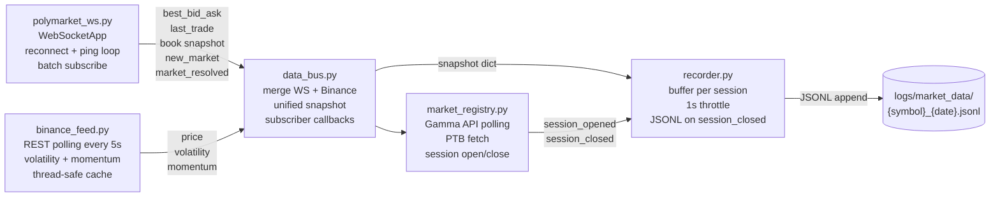

# Data Ingestion

Event-driven market-data recorder for Polymarket binary crypto price-interval markets.
Pure data plumbing — no authentication, no signing, no order execution.

---

## What this demonstrates

| Technique | Implementation |
|-----------|---------------|
| WebSocket client with reconnect + exponential backoff | `polymarket_ws.py` |
| Dual-source data merge (WS + REST polling) | `data_bus.py` |
| Thread-safe cache with stale-data guard | `binance_feed.py`, `data_bus.py` |
| Event-driven session lifecycle (open → buffer → flush) | `recorder.py`, `market_registry.py` |
| Single-instance lock (fsync + PID check, cross-platform) | `recorder.py` |
| 1-second throttle on per-tick JSONL writes | `recorder.py` |
| Hybrid WS + polling for market discovery | `market_registry.py` |
| Double-open idempotency guard under lock | `market_registry.py` |

---

## Architecture



**All five files communicate only through callbacks and snapshot dicts** — no shared
global state except the `DataBus` instance, which is the deliberate, documented
integration point.

---

## Snapshot schema

Each `DataBus` tick produces a unified snapshot dict passed to all subscribers:

```python
{
    "token_id":          "...",    # Polymarket CLOB token ID (YES side always)
    "symbol":            "BTC",
    "interval":          5,        # session length in minutes
    "seconds_remaining": 142,      # countdown to session expiry

    # Polymarket CLOB orderbook
    "mid":               0.615,    # YES token mid price (0–1)
    "spread":            0.010,
    "bid_volume":        340.5,    # USDC liquidity, top-5 levels
    "ask_volume":        120.2,
    "imbalance":         0.478,    # (bid−ask)/(bid+ask)
    "last_trade":        0.610,    # most recent trade price (None at session open)

    # Binance spot
    "binance_price":     83420.5,
    "price_diff_pct":    0.024,    # % drift from session-open price (PTB)
    "volatility":        0.082,    # % std dev of last 20 1-min closes
    "momentum_3m":       0.014,    # % 3-min price change
    "momentum_5m":      -0.031,    # % 5-min price change

    "timestamp":         1773100536.5,
}
```

---

## JSONL session record schema

At session close, `recorder.py` appends one JSON record per file:

**Session-level fields:**

| Field | Type | Description |
|-------|------|-------------|
| `slug` | str | Market slug — primary join key |
| `symbol` | str | Asset symbol (`"BTC"`, `"ETH"`, …) |
| `interval` | int | Session duration in minutes (5 or 15) |
| `recorded_at` | float | Unix ts when session opened |
| `ptb` | float | Binance price at session open ("price to beat") |
| `open_binance_price` | float | Binance price at first snapshot |
| `open_volatility` | float | % std dev at session open |
| `open_momentum_5m` | float | 5-min momentum at session open |
| `close_price` | float | Binance price at session close |
| `close_volatility` | float | % std dev at session close |
| `actual_outcome` | str | `"UP"` or `"DOWN"` |
| `snapshots` | list | Per-tick records (see below) |
| `market_info` | dict | Token IDs, condition ID, end date |

**Per-tick `snapshots[]` fields:** `t` (seconds remaining), `mid`, `spread`,
`bid_volume`, `ask_volume`, `imbalance`, `last_trade`, `binance_price`,
`price_diff_pct`, `momentum_3m`, `momentum_5m`, `timestamp`.

**Near-expiry note:** at `t ≤ 22` the book drains — bid volume approaches 0,
imbalance reaches −1.0. The final `t=0` record is a synthetic settlement stub.
Do not use ticks from `t < 30` for analysis.

---

## Endpoints used

All public, no authentication required:

| Module | Endpoint |
|--------|----------|
| `polymarket_ws.py` | `wss://ws-subscriptions-clob.polymarket.com/ws/market` |
| `binance_feed.py` | `https://api.binance.com/api/v3` |
| `market_registry.py` | `https://gamma-api.polymarket.com` |
| `market_registry.py` | `https://polymarket.com/api/crypto/crypto-price` |

> **Execution boundary:** This module records market data only. Order execution,
> signing, and authentication are not present here and are not shipped in this
> repository. See the top-level README for the execution architecture diagram.

---

## Requirements & running

Install dependencies:

```
pip install requests websocket-client
```

(`websocket-client` is the PyPI package that supplies the `websocket` import in
`polymarket_ws.py`. `requests` is used by `binance_feed.py` and `market_registry.py`.)

Smoke-import check (run from inside `data_ingestion/`):

```
python -c "import recorder, data_bus, polymarket_ws, binance_feed, market_registry; print('OK')"
```

**Live recorder** — connects to public Polymarket + Binance feeds, no authentication
required, writes one JSONL file per symbol per day to `logs/market_data/`:

```
python recorder.py --symbols BTC ETH SOL XRP --intervals 5 15
```

Press `Ctrl+C` to stop. A single-instance lock (`logs/.recorder.lock`) prevents two
recorder processes from writing to the same files simultaneously.
